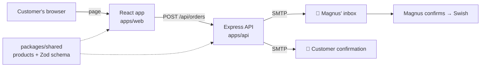

# Architecture

## Decisions

- **Monorepo with npm workspaces.** One install, one lint/format config, one `npm run check`.
- **Shared package ships TypeScript source.** Vite and `tsx` compile it directly; `tsup` bundles
  it into the API build. No separate build step to forget.
- **Validation lives in `shared`.** The same Zod schema drives the form's types and the API's
  input validation, so they cannot drift apart.
- **`createApp()` is separate from `server.ts`.** Tests spin up the app with a fake mailer and
  hit it with Supertest, without opening a port or sending mail.
- **No database in v1.** Email is the record. Add SQLite (e.g. via Drizzle) when Magnus wants an
  order list, stock tracking or class-sale statistics.
- **Spam protection:** hidden honeypot field + rate limiting (10 orders / 15 min / IP) + Helmet
  security headers + 20 kB body limit.
- **`API_PORT` before `PORT`.** Hosting platforms set `PORT`; locally `API_PORT` keeps the API
  from colliding with other tools that read `PORT`.

## Next steps

1. Admin view (password-protected) listing orders, backed by SQLite.
2. Swish QR code in the confirmation email (amount + order number prefilled).
3. Stock counter so the site shows "Slutsåld" when the harvest runs out.
4. Online payment (see [business.md](business.md#payment-options)) when volume justifies it.
