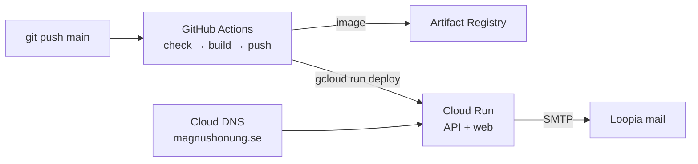

# Deployment (GCP Cloud Run)



- **Terraform** (`infra/terraform`) owns the infrastructure: Cloud Run service, Artifact
  Registry, Secret Manager, Cloud DNS, service accounts, keyless GitHub auth (Workload Identity Federation),
  domain mapping and the **10 SEK/month budget alert**. Run it from your machine.
- **GitHub Actions** (`.github/workflows/deploy.yml`) owns the running image: every push to
  `main` runs `npm run check`, builds the `Dockerfile`, pushes it and deploys a new revision. Pull
  requests only run the check.

## Cost

The only running cost is the Cloud DNS zone (about 0.20 USD/month). Cloud Run scales to zero and
the always-free tier (2M requests/month) covers a site this size.
Artifact Registry keeps only the 3 newest images to stay under 0.5 GB. `max_instance_count = 2`
caps what a traffic spike can cost. The budget **only alerts**, it does not stop spending. Alerts
go by email to the billing account admins at 50 %, 90 % and 100 % (actual and forecasted).

## First-time setup

Tools: `brew install --cask google-cloud-sdk` and `brew install hashicorp/tap/terraform`.

1. **Create the project** and link billing:

   ```bash
   gcloud auth login
   gcloud auth application-default login
   gcloud projects create magnus-honung
   gcloud billing accounts list
   gcloud billing projects link magnus-honung --billing-account=<ID>
   gcloud services enable cloudresourcemanager.googleapis.com serviceusage.googleapis.com \
     --project=magnus-honung
   ```

   Check the billing account's currency (Console → Billing → Account management). If it isn't
   SEK, set `budget_currency` to match.

2. **Create the state bucket** (see [State](#state)), then **apply Terraform:**

   ```bash
   cd infra/terraform
   cp terraform.tfvars.example terraform.tfvars   # fill in
   terraform init
   TF_VAR_smtp_pass='<Loopia mail password>' terraform apply
   ```

   The SMTP password goes to Secret Manager as a write-only value; it is never stored in the
   Terraform state. To change it later, bump `smtp_pass_version` and apply again.

3. **Connect GitHub:** run `terraform output github_variables` and add each key/value under
   GitHub → Settings → Secrets and variables → Actions → **Variables** (not secrets; none of them
   are sensitive). Then push to `main`. The first run replaces the placeholder "hello" container.

4. **Domain.** `magnushonung.se` is registered at Loopia, but DNS is hosted in **Google Cloud DNS**
   (`infra/terraform/dns.tf`), since Loopia's DNS editor costs extra. All records live in Terraform.
   1. In Loopia Customer Zone → magnushonung.se → **Namnservrar**, enter the four servers from
      `terraform output name_servers`.
   2. In [Google Search Console](https://search.google.com/search-console), add a **Domain**
      property with the same Google account that runs Terraform. Put the
      `google-site-verification=...` value in `apex_txt`, apply, then click Verify.
   3. Set `domains = ["magnushonung.se", "www.magnushonung.se"]` and apply. This creates the Cloud
      Run domain mappings and their A/AAAA/CNAME records. HTTPS is issued automatically, usually
      within an hour.
   4. Mail records from Resend go in `extra_dns_records`.

## State

Terraform state lives in the versioned bucket `gs://magnus-honung-tfstate` (europe-north1). It was
created once by hand before the first `terraform init`:

```bash
gcloud storage buckets create gs://magnus-honung-tfstate --location=europe-north1 \
  --uniform-bucket-level-access --public-access-prevention
gcloud storage buckets update gs://magnus-honung-tfstate --versioning
```

`terraform.tfvars` is gitignored (the repo is public). Keep a copy somewhere safe.
